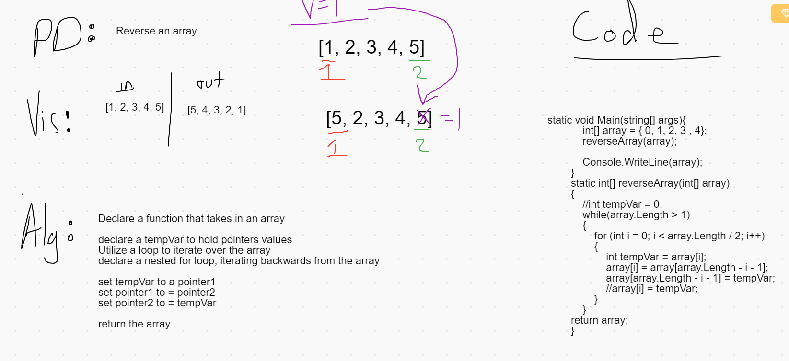

# Daily Code Challenge - Array Reverse

## Perfect Sequence
*Author: Matthew Petersen*

---

### Problem Domain

Reverse a given array.

---

### Inputs and Expected Outputs

| Input | Expected Output |
| :----------- | :----------- |
| [1, 2, 3, 4, 5] | [5, 4, 3, 2, 1] |

---

### Big O

| Time | Space |
| :----------- | :----------- |
| O(n) | O(n) |

Utilizing a for loop, I iterate over the given array / 2. I do this to find the middle of the array, then we can perform our swaps. 
---

### Whiteboard Visual
***[Your Whiteboard Image]***

---

### Change Log
No current changes at this time.  

---
