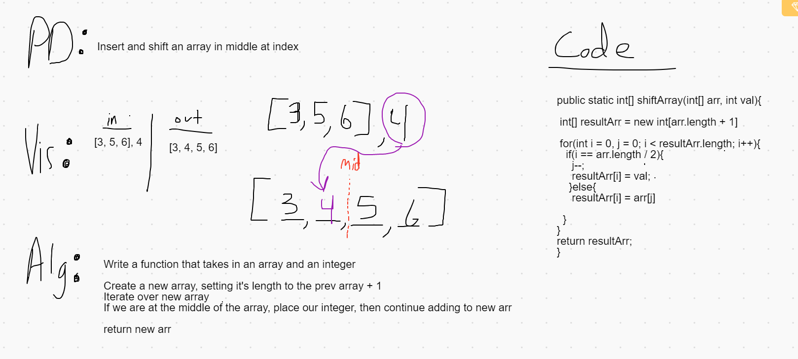

# Daily Code Challenge - Array Shift

## Perfect Sequence
*Author: Matthew Petersen*

---

### Problem Domain

Given an integer array and an integer, insert the integer to the middle of the array.

---

### Inputs and Expected Outputs

| Input | Expected Output |
| :----------- | :----------- |
| [3, 5, 6], 4 | [3, 4, 5, 6] |

---

### Big O

| Time | Space |
| :----------- | :----------- |
| O(n) | O(2n) |

---

### Whiteboard Visual
***[Your Whiteboard Image]***

---

### Change Log
No current changes at this time.  

---
